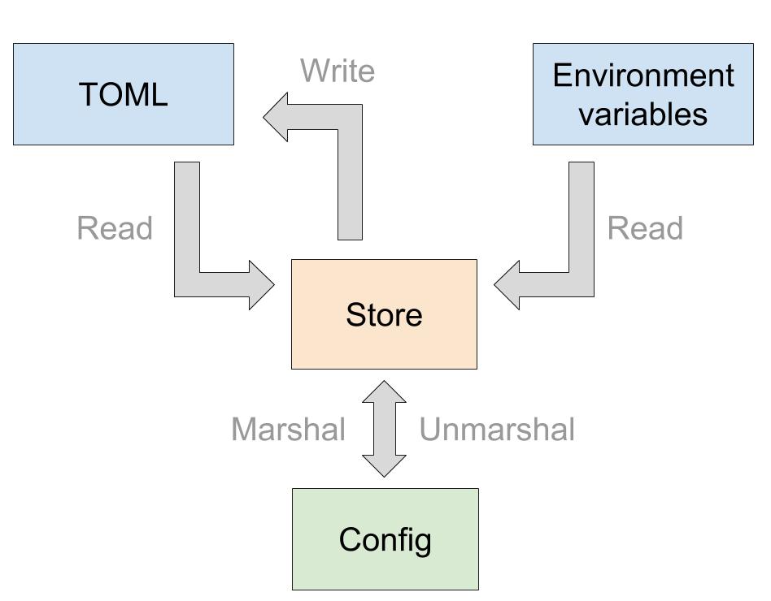

# config

The config package manages the DC/OS CLI configuration for a given cluster.

The DC/OS CLI configuration is persisted to the filesystem as a TOML document. In practice it usually lives in the user's home directory, under `~/.dcos/clusters/<cluster-UUID>/dcos.toml`. The configuration can also be read through environment variables. For more information about the DC/OS CLI configuration, please refer to https://docs.mesosphere.com/1.11/cli/command-reference/dcos-config/.

## Goals

The goals of the config package are to :

- Create, Read and Update DC/OS configurations.
- Validate DC/OS configurations.
- Provide a well-defined struct representing the "core" configuration.

## Implementation

To do so, the config package follows the [Data Mapper pattern](https://en.wikipedia.org/wiki/Data_mapper_pattern). It exposes 2 structures : **Config** and **Store**.

The **Config** struct is the **domain model** for the DC/OS CLI configuration. It is agnostic from any data source or configuration format.

The **Store** is the **data source / persistence layer** for the configuration. It reads from different sources (TOML / environment variables) and writes to a single one (TOML).

The rationale behind this architecture is :

- **Splitting** the domain logic with the persistence layer gives **more control** on how we handle configuration. We can for instance easily create and update configuration data in the in-memory TOML tree and persist it to the disk only when needed.

- The representation of a TOML document is a **Tree**, and in practice we are almost always interested in its leaves. Dealing with the Tree directly would **not be user-friendly** for the caller, having a **key-value kind of approach** with a store is more appropriate for our use-cases.

- We do not exclusively rely on a TOML document for the configuration. It is also possible to use **environment variables** such as *DCOS_URL*. Having a single API **abstracting these 2 sources** makes sense.

The action of creating a Config from a Store is called **unmarshalling**. In practice this happens at the beginning of each command, when parsing the configuration for the currently attached cluster.

The action of generating a Store from a Config is called **marshalling**. In practice this happens less often than unmarshalling, when setting-up a cluster for example.
